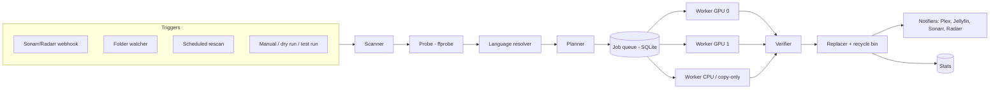

# ReelHaven Architecture

> Automatic, language-aware video library compression for Unraid.
> Status: design complete, no application code yet. Every decision here is
> binding until changed by a new ADR in `docs/adr/`.

## 1. Purpose

ReelHaven shrinks a home media library (movies, TV, other video) without
making the user learn ffmpeg. It re-encodes video using hardware encoders on
every available GPU, strips audio and subtitle tracks in languages the user
doesn't want, and keeps Plex, Jellyfin, Sonarr and Radarr in sync afterwards.

What makes it different from Tdarr, Unmanic and FileFlows:

- **Simple and opinionated.** Sensible defaults, a small number of clear
  settings, no plugin stacks.
- **Mimic profiles.** Drop in a file you like; ReelHaven reads its video and
  audio settings and builds a profile that reproduces them across a library.
- **Original-language awareness.** It knows what language each title was
  produced in and uses that to decide which tracks to keep, and to catch
  files that arrived with the wrong language entirely.
- **Safety first.** Nothing is replaced until the new file is verified, and
  originals go to a recycle bin, not the void.

### 1.1 Non-goals (v1)

- Torrent/seeding libraries. ReelHaven assumes it owns the files it processes
  and may replace them. (Hardlink detection is therefore not required.)
- Distributed processing across multiple machines. One container, all its
  GPUs.
- On-the-fly transcoding for playback. That's Plex/Jellyfin's job.
- Upscaling. ReelHaven never increases resolution.

## 2. Glossary

| Term | Meaning |
|---|---|
| Library | A folder of media with a type (movies, tv, other), a profile, a language policy and a watch mode. |
| Profile | Video and audio encode settings: codec, quality, resolution rule, audio handling. |
| Mimic | Building a profile automatically from a sample file. |
| Language policy | Which audio/subtitle languages to keep and which tracks become default. |
| Plan | The list of actions ReelHaven intends to take for one file (encode, strip tracks, set defaults, skip, flag). |
| Job | One file moving through the pipeline. |
| Dry run | Plans every file in a library and reports what *would* happen. Touches nothing. |
| Test run | Fully processes a few sample files per library into a separate output folder so the user can inspect results. Originals untouched. |
| Recycle bin | Where replaced originals go for a configurable number of days. |
| Quarantine | Where wrong-language files go when that action is enabled. |

## 3. System overview

Everything runs in **one container**: the web server, scheduler, watcher and
workers. This keeps installation a single Unraid template.

## 4. Technology stack

| Concern | Choice | ADR |
|---|---|---|
| Backend | Python 3.13, FastAPI, Uvicorn | 0002, 0009 |
| Encoder | jellyfin-ffmpeg (NVENC, QSV, VAAPI, AMF, tone mapping) | 0003 |
| Database | SQLite (WAL mode) via SQLAlchemy + Alembic migrations | 0004 |
| Job queue | Built in, persisted in SQLite, one worker pool per device | 0004 |
| Frontend | React + TypeScript + Vite + Mantine, served by the backend | 0005, 0014 |
| Live updates | WebSockets | 0005 |
| Charts | @mantine/charts (built on Recharts) | 0014 |
| Python tooling | uv, ruff, mypy, pytest | 0002 |
| Image build | GitHub Actions → ghcr.io, Debian 13 base | 0008, 0009 |
| License | GPL-3.0 | 0001 |

## 5. Container layout

### 5.1 Paths

| Container path | Purpose | Typical Unraid host path |
|---|---|---|
| `/config` | Database, settings, logs, secrets, recycle bin index | `/mnt/user/appdata/reelhaven` |
| `/media` | Libraries (user maps one or more folders under here) | `/mnt/user/media` |
| `/transcode` | Temporary encode output; fast disk recommended | cache pool or appdata subfolder |

Each library has a hidden `.reelhaven/` folder at its root holding the
recycle bin (`recycle/`), remux work files (`work/`) and, later, quarantine
(`quarantine/`). Being on the library's own filesystem, every move is an
instant rename, never a copy (ADR-0016).

### 5.2 Environment variables

| Variable | Default | Purpose |
|---|---|---|
| `PUID` / `PGID` | 99 / 100 | Run as Unraid's `nobody:users` so files aren't owned by root |
| `UMASK` | 022 | Permissions on created files |
| `TZ` | `Etc/UTC` | Timezone for schedules and logs |
| `REELHAVEN_PORT` | 7171 | Web UI port |
| `NVIDIA_VISIBLE_DEVICES` | unset | NVIDIA GPUs to expose (`all` or IDs) |
| `NVIDIA_DRIVER_CAPABILITIES` | `compute,video,utility` | Required for NVENC |

### 5.3 GPU access

- NVIDIA: `--runtime=nvidia` in Extra Parameters plus the two variables above.
- Intel / AMD: pass `/dev/dri` as a device.
- The container must start cleanly with **no** GPU (CPU-only mode).

### 5.4 Process model

The container starts as root only long enough to apply PUID/PGID/UMASK, then
drops privileges. All application code runs as the unprivileged user.

## 6. Components

### 6.1 Scanner
Walks a library, finds video files by extension and by probing, and records
them with size, mtime and a quick fingerprint (size + mtime + first/last
64 KiB hash) so moved or unchanged files are recognised without re-probing.
Ignores `.reelhaven` folders, samples, extras folders (configurable patterns)
and files still being written (see 6.10).

### 6.2 Probe
Runs `ffprobe -show_streams -show_format -of json` and normalises the result
into an internal `MediaInfo` model: container, duration, each stream's codec,
profile, resolution, bit depth, HDR type (HDR10, HDR10+, HLG, Dolby Vision),
bitrate, language tag, title, disposition flags (default, forced, comment,
hearing_impaired). Probe JSON is cached keyed by fingerprint.

### 6.3 Language resolver
Determines the **original production language** of each title, in this order:

1. **Radarr / Sonarr** (if the library is linked): their APIs expose the
   original language for movies and series. Most reliable for managed media.
2. **TMDB** (user supplies a free API key): match by IDs embedded in file or
   folder names (`{tmdb-12345}`, `{imdb-tt…}`, `{tvdb-…}`) first, then by
   title + year.
3. **Unknown**: no original language could be determined. Stripping still
   follows the keep-list, but the "original language" rule can't apply, and
   wrong-language detection is disabled for that file.

Results are cached per title with a refresh interval. The user can override
the original language per title in the UI.

### 6.4 Planner
Pure function: `(MediaInfo, original_language, Library, Profile, Policy) → Plan`.
No I/O, fully unit-testable with probe JSON fixtures. Decides:

- **Video**: encode, copy, or skip (see 7.4 skip rules).
- **Tracks**: which audio and subtitle streams to keep, in which order.
- **Defaults**: which audio and subtitle tracks get the default flag.
- **Flags**: wrong-language file, Dolby Vision, unsupported codec, etc.
- **Job type**: `encode` (needs a GPU/CPU encoder) or `remux` (track changes
  only, stream copy, no encoder needed, very fast).

Every plan includes a human-readable explanation ("Removing French and German
audio: original language is English, keep-list is English").

### 6.5 Job queue and workers
- Jobs live in SQLite so they survive restarts. A job interrupted mid-encode
  restarts from the beginning; partial temp files are cleaned up at startup.
- **Device detection at startup**: NVIDIA via `nvidia-smi`, Intel/AMD via
  `/dev/dri/renderD*` + `vainfo`, plus a short test encode per device to
  confirm the codecs it actually supports.
- **One worker pool per device**, each with its own concurrency setting
  (consumer NVIDIA cards cap simultaneous encode sessions; default 2 per GPU).
- `remux` jobs run in a separate CPU pool so they never wait behind encodes.
- Optional CPU encode pool (off by default, it's slow).
- Scheduling: highest priority first, then oldest. Global pause/resume. An
  optional **processing window** (e.g. only 01:00–07:00) is a later option
  (ADR-0025).
- Progress parsed from ffmpeg `-progress` output and pushed to the UI.

### 6.6 Command builder
Turns a Plan + device into an ffmpeg argument **list** (never a shell string;
see SECURITY.md). One builder per encoder family (nvenc, qsv, vaapi, amf,
libx265/libsvtav1 for CPU), all tested against golden argument snapshots.

### 6.7 Verifier
A new file must pass every check before it can replace the original:

1. ffprobe succeeds and stream layout matches the plan.
2. Duration within tolerance of the source (default ±1 s or 0.5%).
3. Decode test: ffmpeg decodes several short segments spread across the file
   to `-f null` with no errors.
4. Size check: output smaller than source by at least the configured minimum
   savings (default 10%) for `encode` jobs. If not, the result is discarded
   and the file marked "no gain" so it isn't retried.

### 6.8 Replacer
1. The verified output already sits in the library's `.reelhaven/work/`
   (copied there first for GPU encodes), on the same filesystem as the
   original (ADR-0016).
2. Move the original into the recycle bin, then rename the output into the
   original's place, preserving ownership (PUID/PGID) and permissions. Both
   steps are renames; if the filesystems differ, the replacer refuses.
3. If the extension changed (e.g. `.mp4` → `.mkv`), the new name keeps the
   same stem; notifiers are told about the rename.
4. Record before/after sizes, durations and timings for stats.

Recycle bin items are purged after N days (default 14). Restore is one click.

### 6.9 Notifiers
After a successful replace (or quarantine):

- **Sonarr / Radarr**: trigger a rescan of that series/movie so they pick up
  the new size, codec and filename. For wrong-language quarantine, optionally
  mark the release failed/blocklisted and trigger a new search.
- **Plex**: partial scan of the affected folder only.
- **Jellyfin**: notify media updated for the affected path (later; ADR-0025).

Notifications are batched (default 60 s window) to avoid hammering servers
during a big library run. Each integration has a **path mapping** setting,
because Sonarr may see a file as `/tv/Show/…` while ReelHaven sees
`/media/tv/Show/…`.

### 6.10 Watcher and triggers
Three ways a file enters the queue:

1. **Sonarr/Radarr webhook** (preferred): "On Import" and "On Upgrade" events
   call `POST /api/v1/webhook/{sonarr|radarr}` with the API key.
2. **Folder watcher**: inotify (via `watchdog`), with a polling fallback for
   setups where inotify misses changes. A file is only queued once its size
   and mtime have been stable for a configurable period (default 2 minutes).
3. **Scheduled rescan**: full library scan on a schedule (default daily) to
   catch anything missed.

Each library chooses its watch mode: off, watch, or automatic (backlog
included, ADR-0025).

### 6.11 Stats
Recorded per job and aggregated per library and overall: files processed,
skipped, failed; bytes before/after and space saved; average compression
ratio; encode speed (fps and × realtime) per device; time spent. Shown on a
dashboard with totals, trends over time and per-GPU performance.

## 7. Profiles and mimic

### 7.1 Profile fields
- **Video**: codec (HEVC default, AV1 where hardware supports it, H.264),
  quality mode (constant quality value per encoder family, or target bitrate),
  encoder preset (speed vs size), 10-bit output on/off.
- **Resolution**: *keep source* (default) or *cap at* 2160p/1080p/720p.
  Never upscales.
- **HDR**: preserve HDR10/HLG metadata when the encoder supports it;
  otherwise skip the file. **Dolby Vision files are skipped by default**
  (re-encoding breaks DV); optional tone-map to SDR is a later feature.
- **Audio**: *copy* (default) or *transcode* to E-AC-3, AAC or Opus at
  channel-aware bitrates (ADR-0023). Object audio (TrueHD Atmos, E-AC-3 JOC)
  is copied, unless the profile downmixes surround to stereo (ADR-0024).
  Optional "add a stereo AAC compatibility track."
- **Container**: MKV (default) or MP4.
- **Skip rules**: see 7.4.

### 7.2 Mimic
1. User picks a sample file from a library via the file browser (ADR-0022;
   no upload).
2. ffprobe reads codecs, profile, level, resolution, bit depth, HDR, audio
   codecs, channels and bitrates.
3. **Encoder settings extraction**: x264/x265 embed their full settings
   string in the stream (SEI); HandBrake and some tools add tags. If found,
   ReelHaven reads the CRF/preset directly.
4. **Fallback estimation**: compute video bits-per-pixel-per-frame and map it
   to a quality value for the target encoder using a calibration table
   (shipped with the app, refined by tests).
5. The resulting profile opens in an editor, clearly marking which values
   were *read* and which were *estimated*, before it's saved.

### 7.3 Quality mapping between encoders
Hardware encoders don't use x265 CRF numbers. The profile stores a
normalised quality level, and each command builder maps it to the right
encoder parameter (NVENC `-cq`, QSV `-global_quality`, VAAPI `-qp`/`-rc_mode`).
Mapping tables live in one module with tests.

### 7.4 Skip rules (defaults)
- Already in the target codec **and** bitrate at or below the profile's
  expected bitrate for that resolution → skip encode (track changes may still
  produce a `remux` job).
- Estimated savings below the minimum (default 10%) → skip.
- Dolby Vision, unsupported or corrupt input → skip and flag.
- Previously processed by ReelHaven (marker tag written into the file's
  metadata) → skip unless the profile changed.

## 8. Language policy

### 8.1 Settings (per library, with global defaults)
- **Keep languages**: default `English` + `original language`.
- **Subtitles to keep**: English full, English forced, English SDH (toggle).
- **Commentary tracks**: keep English commentary (toggle).
- **Untagged tracks** (`und` or no tag): keep (default) or treat as a specific
  language. Untagged audio never triggers wrong-language detection (ADR-0017).

### 8.2 Track rules
- Keep audio in the keep-list. **Never remove the last audio track.** If no
  audio track matches, keep all audio and flag the file (see 8.4).
- Keep subtitles in the keep-list per the toggles above. Image-based subs
  (PGS, VobSub) are kept as-is; no OCR in v1.
- **Forced detection**: disposition `forced` flag, or a title containing
  "forced". (Heuristics based on subtitle size are a later improvement.)

### 8.3 Default track rules
- **Audio default**: original language if kept, otherwise English.
- **Subtitle default**:
  - Default audio is English → **English forced** is the default subtitle
    (if present); no other subtitle is default.
  - Default audio is not English → **English full** subtitles are default.
- All other tracks have the default flag cleared.

### 8.4 Wrong-language files
Triggered when the original language is known and **no audio track** is in
the keep-list (e.g. an English-original show with only Spanish audio).
Action per library:

- **Flag** (default): listed in the UI for review, nothing changes.
- **Quarantine + replace**: move to quarantine, tell Sonarr/Radarr to
  blocklist the release and search again.
- **Delete**: explicit opt-in with a warning; still goes through the
  recycle bin.

## 9. Dry run and test run

- **Dry run**: plans every file in a library and produces a report: counts by
  action, estimated savings, track changes, flagged files. Read-only.
- **Test run** (ADR-0020, ADR-0021): re-encodes a small sample per library
  (default 1, up to 5) into `/transcode/test-run/<library>/`, measures
  quality (XPSNR, SSIM) and shows size before/after plus still frames side by
  side. Originals untouched. Bulk encoding a library **requires an approved
  test run with its current profile.**

## 10. Data model (initial)

| Table | Key fields |
|---|---|
| `users` | id, username, password_hash, totp_secret (encrypted), totp_enabled, created_at |
| `sessions` | id (hashed), user_id, expires_at, ip, user_agent |
| `settings` | key, value (JSON) |
| `libraries` | id, name, type, path, profile_id, language_policy (JSON), watch_mode, wrong_language_action, test_run_passed_at |
| `profiles` | id, name, settings (JSON), source (manual/mimic), mimic_report (JSON) |
| `integrations` | id, kind, name, base_url, api_key (encrypted), verify_tls, path_mappings (JSON), enabled |
| `media_files` | id, library_id, path, size, mtime, fingerprint, probe (JSON), original_language, language_source, status |
| `jobs` | id, media_file_id, type, plan (JSON), status, device, priority, progress, started_at, finished_at, error |
| `job_results` | job_id, bytes_before, bytes_after, duration_s, encode_seconds, fps |
| `recycle_bin` | id, original_path, stored_path, job_id, expires_at |
| `audit_log` | id, at, actor, action, target, detail |

Migrations via Alembic from the first schema onward.

## 11. API and UI

### 11.1 API
REST under `/api/v1`, JSON, OpenAPI docs generated by FastAPI (served only
to authenticated users). WebSocket at `/api/v1/ws` for job progress and
queue changes: it pushes the running jobs and queue counts when they change
(at most twice a second). It needs a session cookie and a same-site `Origin`;
the UI falls back to polling without it (local-address bypass). Webhook
endpoints authenticate with the API key, everything else with a session (see
SECURITY.md).

### 11.2 UI pages
- **Setup wizard** (first run): create admin account → detect GPUs → add
  libraries → choose or mimic a profile → language policy → integrations →
  test run.
- **Dashboard**: stats, active jobs with live progress, per-GPU activity.
- **Libraries**: list, settings, dry run, test run, scan now.
- **Profiles**: list, editor, mimic.
- **Queue**: pending/active/failed jobs, reorder, retry, cancel, pause.
- **Review**: flagged files (wrong language, DV, errors) with actions.
- **Recycle bin / Quarantine**: restore or purge.
- **Settings**: integrations, security (password, 2FA, API key,
  local-address bypass), schedules, logs.

## 12. Logging and observability
Structured JSON logs to stdout (visible in Unraid's log viewer) and a
rotating file in `/config/logs`. Per-job ffmpeg output saved (truncated) for
failed jobs. Secrets are redacted by a logging filter. A `/healthz`
endpoint (unauthenticated, no details) for Docker health checks.

## 13. Testing strategy
- **Unit**: planner, language rules, mimic estimation and quality mapping,
  driven by probe JSON fixtures. These are the heart of the app and need the
  best coverage.
- **Command builder**: golden-snapshot tests of argument lists per encoder.
- **Integration**: real CPU encodes of tiny synthetic files generated with
  ffmpeg (multi-language audio/subs, forced flags, `und` tracks, HDR
  metadata). The dev environment keeps sample media in a folder **outside
  the repo**; tests generate their own fixtures at runtime.
- **API**: FastAPI test client, including auth and permission tests.
- **Frontend**: component tests for key flows (setup wizard, mimic editor).
- GPU encoding is verified manually on real hardware before each release
  (checklist in `docs/release.md`, written in phase 5).

## 14. Build and release
- Multi-stage Dockerfile: build frontend → build Python wheel → final image
  on Debian 13 (trixie) slim with jellyfin-ffmpeg and the Intel/AMD media
  drivers.
- GitHub Actions builds and pushes to `ghcr.io/dannyelson82/reelhaven` on
  tags (`vX.Y.Z`, `latest`) and on `main` (`edge`). Image vulnerability scan
  in CI.
- **No Docker socket in the dev environment.** Images are only built by CI.
- Unraid template in `unraid/reelhaven.xml`, icon in `assets/`. Template is
  written to Community Applications standards so CA submission later is just
  paperwork.

## 15. Roadmap

| Phase | Scope |
|---|---|
| 0.1 Foundation | Project skeleton (backend + frontend), config, logging, SQLite + Alembic, audit log table (ADR-0010), auth (login, sessions, local-address bypass, API key), setup wizard step 1, Dockerfile, CI (lint, test, image build). |
| 0.2 + 0.3 Library and languages (ADR-0015) | Libraries, scanner, probe, file browser, library view with stream details; language resolver (TMDB, Sonarr, Radarr), language policy, planner for track changes, dry run, `remux` jobs, verifier, replacer, recycle bin. *First release that changes files*, on manual request only (per file, or per library after confirmation). Automatic processing waits for test runs (0.4). |
| 0.4 Encoding | Device detection, worker pools, profiles, command builders, skip rules, test run (quality-checked, gates bulk encoding, ADR-0020), queue UI with live progress. |
| 0.5 Mimic | Sample selection from libraries (ADR-0022), settings extraction, estimation, audio re-encoding and audio-only jobs (ADR-0023), profile editor. |
| 0.6 Automation | Watch modes and automatic processing (ADR-0025), webhooks, folder watcher, scheduled rescans, notifiers (Plex, Sonarr, Radarr). |
| 0.7 Insight and safety | Stats dashboard, review page, wrong-language quarantine + re-search, optional TOTP 2FA, audit log page. |
| 1.0 | Hardening, docs, release checklist, CA submission. |

Language handling ships before encoding on purpose: it's fast (stream copy),
low risk, and exercises the whole verify → replace → notify pipeline before
anything expensive runs.

## 16. Open questions
- Whether to offer AV1 by default on GPUs that support it, or keep HEVC as the
  default for player compatibility.
- Subtitle OCR (PGS → SRT) and Dolby Vision handling are post-1.0 candidates.
